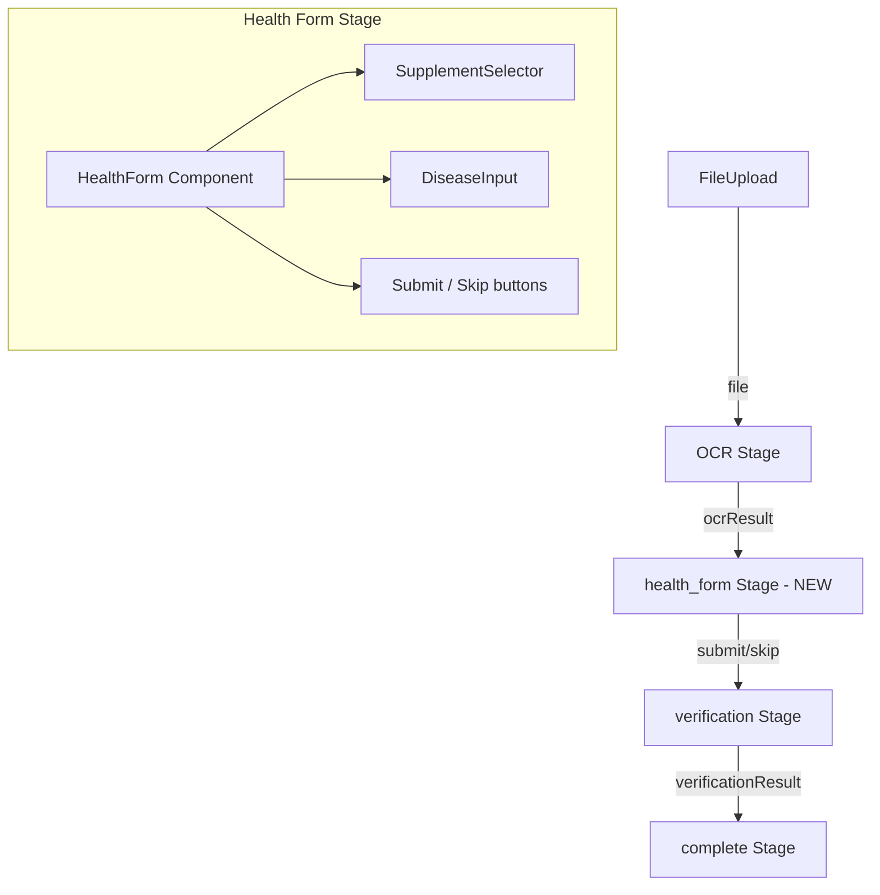

# Design Document: Post-Upload Health Form

## Overview

This feature introduces a health context form that appears after OCR extraction completes and before verification begins. The form collects optional supplement and disease information from the user, then sends it alongside the extracted biomarkers to the existing `POST /api/verify` endpoint. A new pipeline stage `'health_form'` is inserted between `'ocr'` and `'verification'` in the existing `PipelineStage` type.

The implementation is entirely frontend — no backend changes are needed. The existing `/api/verify` endpoint already accepts `supplements` and `medications` fields.

## Architecture



**Pipeline Stage Flow (updated):**
```
idle → uploading → ocr → health_form → verification → analysis → complete
                                                              ↘ error
```

The `App.tsx` Pipeline_Controller manages stage transitions. After OCR completes, instead of jumping to `'analysis'` or `'complete'`, it transitions to `'health_form'`. The `HealthForm` component receives the OCR biomarkers as a prop and calls back with the user's health context (or skip signal). App.tsx then calls the verify API and manages the verification/complete stages.

## Components and Interfaces

### New Pipeline Stage

Add `'health_form'` to the `PipelineStage` union type in `src/types/index.ts`:

```typescript
export type PipelineStage = 'idle' | 'uploading' | 'ocr' | 'health_form' | 'verification' | 'analysis' | 'complete' | 'error';
```

### HealthForm Component

**Location:** `src/components/HealthForm/HealthForm.tsx`

```typescript
interface HealthFormProps {
  onSubmit: (supplements: string[], diseases: string) => void;
  onSkip: () => void;
}
```

- Manages local state for selected supplements and disease text
- Renders `SupplementSelector` and `DiseaseInput` sub-components
- Provides "Submit" and "I don't want to answer" buttons
- Calls `onSubmit` with collected data or `onSkip` for skip

### SupplementSelector Component

**Location:** `src/components/HealthForm/SupplementSelector.tsx`

```typescript
interface SupplementSelectorProps {
  selected: string[];
  onChange: (selected: string[]) => void;
}
```

- Displays predefined supplement list as toggle chips/buttons
- Supports multi-select (toggle on/off)
- Includes "Other" option that reveals a free-text input
- Custom supplement added via "Other" is appended to the selected array

**Predefined supplements:**
```typescript
const PREDEFINED_SUPPLEMENTS = [
  'Vitamin D', 'Vitamin B12', 'Iron', 'Omega-3', 'Magnesium',
  'Zinc', 'Calcium', 'Biotin', 'Folic Acid', 'Multivitamin',
] as const;
```

### DiseaseInput Component

**Location:** `src/components/HealthForm/DiseaseInput.tsx`

```typescript
interface DiseaseInputProps {
  value: string;
  onChange: (value: string) => void;
}
```

- Free-text textarea with 500-character max length
- Descriptive label and placeholder text
- Shows remaining character count when approaching limit

### Verify API Client

**Location:** `src/api/verify.ts`

```typescript
import type { Biomarker, VerificationResponse } from '../types';

export interface VerifyPayload {
  biomarkers: Biomarker[];
  supplements?: string[];
  medications?: string[];
}

export async function verifyBiomarkers(payload: VerifyPayload): Promise<VerificationResponse> {
  const API_BASE = import.meta.env.VITE_API_BASE ?? '';
  const response = await fetch(`${API_BASE}/api/verify`, {
    method: 'POST',
    headers: { 'Content-Type': 'application/json' },
    body: JSON.stringify(payload),
  });

  if (!response.ok) {
    const errorBody = await response.text();
    throw new Error(`Verification failed (${response.status}): ${errorBody}`);
  }

  return response.json();
}
```

Note: The disease text is sent as part of the `medications` field (as a string in the array) since the backend `VerificationRequest` schema accepts `medications: Optional[List[str]]`. Alternatively, we map diseases to the `medications` field for now since the backend treats them similarly for interference checks.

### App.tsx Integration

The `handleFileSelected` and `handleDemoScenario` functions are updated:

1. After OCR completes → set stage to `'health_form'`
2. New handler `handleHealthFormSubmit(supplements, diseases)`:
   - Set stage to `'verification'`
   - Call `verifyBiomarkers({ biomarkers: ocrResult.biomarkers, supplements, medications: diseases ? [diseases] : undefined })`
   - On success: store result, set stage to `'analysis'` or `'complete'`
   - On error: set error, set stage to `'error'`
3. New handler `handleHealthFormSkip()`:
   - Calls `handleHealthFormSubmit([], '')`

## Data Models

### VerifyPayload (frontend)

```typescript
interface VerifyPayload {
  biomarkers: Biomarker[];
  supplements?: string[];
  medications?: string[];
}
```

Maps to the backend `VerificationRequest`:
- `biomarkers` → `biomarkers` (direct mapping, same shape)
- `supplements` → `supplements` (string array)
- `medications` → `medications` (disease text wrapped in array, or undefined)

### Form State (local to HealthForm)

```typescript
interface HealthFormState {
  selectedSupplements: string[];
  otherSupplement: string;
  showOtherInput: boolean;
  diseases: string;
}
```

## Correctness Properties

*A property is a characteristic or behavior that should hold true across all valid executions of a system — essentially, a formal statement about what the system should do. Properties serve as the bridge between human-readable specifications and machine-verifiable correctness guarantees.*

### Property 1: Supplement selection state consistency

*For any* subset of the predefined supplement list combined with any custom "Other" supplement text, the collected supplements array SHALL contain exactly the selected predefined supplements plus the custom supplement (if non-empty), with no duplicates and no omissions.

**Validates: Requirements 2.2, 2.5**

### Property 2: Disease input length constraint

*For any* string input to the Disease_Input, the stored value SHALL have a length of at most 500 characters. Strings of length ≤ 500 are stored verbatim; strings longer than 500 are constrained to 500 characters.

**Validates: Requirements 3.2**

### Property 3: Payload construction correctness

*For any* combination of a biomarkers array, a selected supplements array, and a disease text string, the constructed Verification_Payload SHALL contain the exact biomarkers array, the exact supplements array, and the disease text mapped to the medications field — with no data loss or mutation.

**Validates: Requirements 4.2**

## Error Handling

| Scenario | Behavior |
|----------|----------|
| Verify API returns HTTP error (4xx/5xx) | Display error message, keep biomarker results visible, allow resubmission |
| Verify API network failure | Display "Network error" message, allow retry |
| Verify API timeout | Display timeout message after 30s, allow retry |
| Invalid form state (shouldn't happen since all fields optional) | Submit button always enabled, no client-side validation errors |

On error, the pipeline transitions to `'error'` stage but the biomarker data (`ocrResult`) is preserved in state so the user can retry without re-uploading.

## Testing Strategy

**Unit Tests (example-based):**
- HealthForm renders heading, submit button, skip button
- SupplementSelector renders all predefined supplements
- Clicking "Other" reveals free-text input
- Submit constructs correct payload and calls onSubmit
- Skip calls onSkip
- Pipeline transitions correctly on submit/skip
- Error state displays error and allows retry
- Accessibility: ARIA labels, keyboard navigation

**Property Tests (using fast-check):**
- Property 1: Supplement selection state consistency — generate random subsets of supplements + optional custom text, verify collected array matches
- Property 2: Disease input length constraint — generate arbitrary strings, verify stored value ≤ 500 chars
- Property 3: Payload construction — generate random biomarker arrays + supplement arrays + disease strings, verify payload structure

**Property Test Configuration:**
- Library: `fast-check` (standard PBT library for TypeScript)
- Minimum 100 iterations per property
- Tag format: `Feature: post-upload-health-form, Property N: <title>`

**Integration Tests:**
- Mock `fetch` to verify correct API call shape
- Test full flow: OCR complete → health_form → submit → verification → complete
